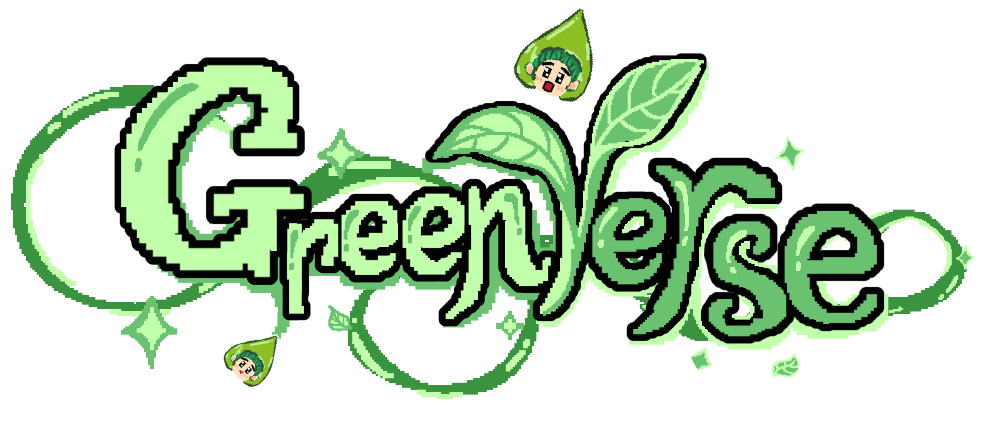

 

# 🌍GREENVERSE – jet2holiday

> “Green Truths, not Green Trends”  
> Một web app game tương tác giúp thế hệ trẻ nhận diện **greenwashing** và hành động vì **môi trường bền vững**.  

---

## 💡 Giới thiệu

+ **Greenverse** là một web app game được phát triển trong khuôn khổ YouthAI hackathon chủ đề *Environment*.  
+ Người chơi hóa thân thành “anh hùng môi trường” – tham gia các minigame nhận diện greenwashing, chọn hành vi đúng, và nhận phản hồi cá nhân hóa từ AI.

+ Khi kết thúc trò chơi, người chơi sẽ thấy kết quả tác động của mình lên Trái Đất:  
    - 🌱 **Trái Đất xanh** nếu điểm cao.  
    - 🗑️ **Trái Đất đầy rác** nếu phạm nhiều lỗi.  

---

##  Mục tiêu dự án

- Tăng nhận thức của giới trẻ về greenwashing & tiêu dùng bền vững.  
- Ứng dụng AI (Gemini API) để tạo phản hồi thông minh, thân thiện.  
- Gamify kiến thức môi trường, biến học thành trải nghiệm vui và gần gũi.  

---

## Công nghệ sử dụng

| Thành phần | Công nghệ |
|-------------|------------|
| Frontend | React (Create React App) |
| Style/UI | TailwindCSS + concept Pixel Art  |
| Data | JSON file (chứa câu hỏi & đáp án) |
AI Feedback (Planned) | Google Gemini API (sẽ được tích hợp để cá nhân hóa phản hồi người chơi trong phiên bản tiếp theo)
---

## 🚀 Cách chạy dự án (Local)

Clone repo:
```bash
   git clone https://github.com/nghuynn1512/greenverse.git
   cd greenverse
```

Cài đặt dependencies:

```bash
npm install
```
Chạy project:

```bash
npm start
```
**Ứng dụng sẽ chạy tại http://localhost:3000.**


##  Thành viên nhóm jet2holiday

| Thành viên | Vai trò |
|-------------|------------|
| Nguyễn Thị Diệu Linh | Team Leader/ PM |
| Trần Thị Ngọc Huyền | Tech & Research  |
| Phùng Thị Thanh Thảo | Content & UI/UX design |
| Nguyễn Lê Thảo | Design & Art |
| Nguyễn Anh Thư | Video & Marketing |


##  License
+ Dự án được phát triển phục vụ mục đích giáo dục & cộng đồng.
